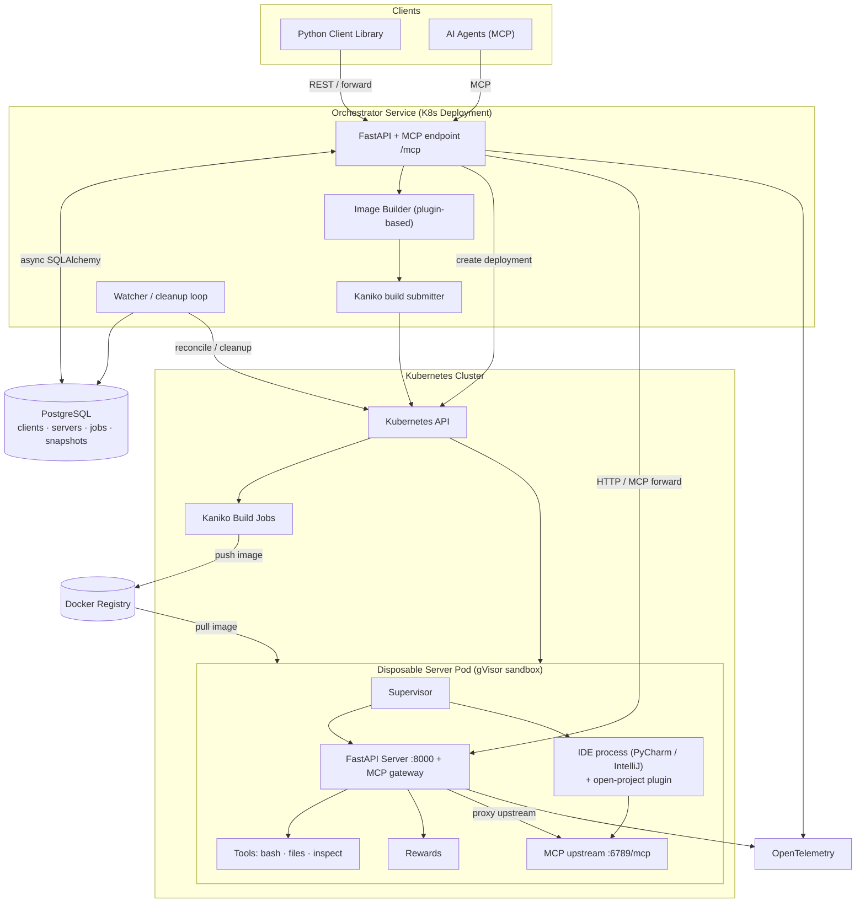

# IdeGYM System Architecture

IdeGYM is a Python framework for creating disposable, scalable development
environments for AI agents. The diagram below shows the high-level component
topology and the main data/control flows.

> **Note on IDE integrations:** PyCharm / IntelliJ are **not** orchestrator
> clients. They run *inside* the disposable server pod as an in-container IDE
> process that exposes an MCP upstream (`:6789`) and an inspection router; the
> in-pod FastAPI server proxies them. The only external clients are the Python
> client library and MCP-speaking AI agents.

## Overview

- **Clients** — two external access patterns: the Python client library
  (programmatic, with HTTP/MCP forwarding) and MCP for AI agents.
- **Orchestrator** — central FastAPI service (plus MCP endpoint at `/mcp`) that
  manages the full environment lifecycle. It persists state in PostgreSQL,
  builds images via the plugin-based Image Builder + Kaniko, and provisions pods
  on Kubernetes. A background watcher reconciles database state with live
  cluster resources.
- **PostgreSQL** — stores clients, servers, build jobs, and pod snapshots
  (async SQLAlchemy + asyncpg).
- **Image building** — plugin-composable Docker images are compiled to a build
  spec and submitted to Kaniko build jobs in-cluster, which push to the registry.
- **Disposable server pods** — each gVisor-sandboxed pod runs Supervisor +
  FastAPI server (`:8000`) + MCP gateway, exposing tools (bash, files, inspect),
  reward calculation, and — when an IDE plugin is included — an in-container IDE
  process that the server proxies as an MCP upstream (`:6789`).
- **Observability** — both orchestrator and server emit traces/metrics via
  OpenTelemetry.

## Key flows

1. **Build image** — client/orchestrator composes an `Image` (plugins) → build
   spec → Kaniko job → image pushed to the registry.
2. **Provision environment** — orchestrator creates a Kubernetes deployment; the
   pod pulls the image and boots Supervisor → FastAPI server (and any in-pod
   IDE process).
3. **Use environment** — client/agent requests are forwarded by the orchestrator
   through to the server pod's HTTP/MCP endpoints; tools execute inside the
   sandbox.
4. **Cleanup** — the watcher loop reconciles database state with the cluster and
   tears down stale resources.

## Related diagrams

- [Plugin ecosystem](plugins.md) — how plugins hook into image build, server
  routing, and client operations.
- [Server internals](server.md) — how a single in-pod server process is
  assembled.
