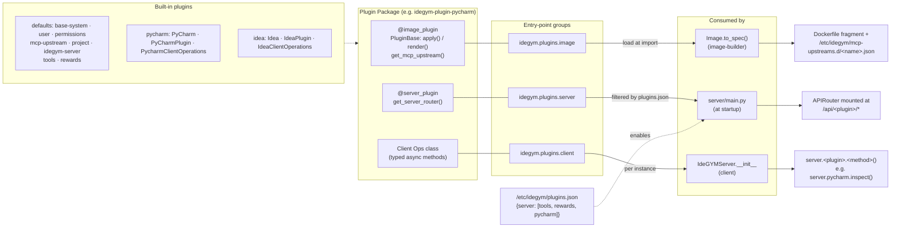

# Plugin Ecosystem

A single plugin package can hook into three distinct integration points. Each is
optional, discovered via its own entry-point group, and consumed by a different
part of the system. See [Plugin Architecture](../plugins.md) for the full
authoring guide.

## Integration points

| Integration point | How | Where consumed | Output |
|---|---|---|---|
| Image building | `@image_plugin("name")` + `apply()` / `render()` | `Image.to_spec()` (image-builder) | Dockerfile fragment |
| MCP upstream | `get_mcp_upstream()` on a `PluginBase` subclass | `Image.to_spec()` (auto-writes config) | `/etc/idegym/mcp-upstreams.d/<name>.json` |
| Server routing | `@server_plugin` + `get_server_router()` | `server/main.py` at startup | `APIRouter` mounted at `/api/<plugin>/*` |
| Client operations | `idegym.plugins.client` entry point | `IdeGYMServer.__init__` | `server.<plugin>.<method>()` |

All methods have no-op defaults, so a plugin only needs to implement the parts
it uses.

## Entry-point groups

| Group | Loaded by | When |
|---|---|---|
| `idegym.plugins.image` | `image-builder` (`builder.py`) | At import time — registry populated before YAML deserialization |
| `idegym.plugins.server` | `server/main.py` | At module load — filtered by `/etc/idegym/plugins.json` |
| `idegym.plugins.client` | `client/server.py` (`IdeGYMServer.__init__`) | Per `IdeGYMServer` instance |

`/etc/idegym/plugins.json` (written by the `IdeGYMServer` image plugin at build
time) controls which server plugins are enabled at runtime. If the file is
absent (development), all installed plugins are loaded.

## Related diagrams

- [System architecture](architecture.md)
- [Server internals](server.md)
