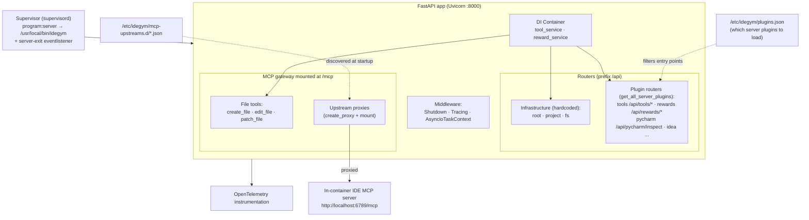

# IdeGYM Server Internals

How a single server process is assembled inside the disposable pod: Supervisor
boots the FastAPI app, which mounts infrastructure routers, plugin routers, and
a FastMCP gateway that proxies in-container MCP upstreams.

## Assembly (`server/main.py`)

1. **Plugin loading** — read `/etc/idegym/plugins.json` to decide which
   `idegym.plugins.server` entry points to load (dev fallback: load all).
2. **App + MCP gateway** — build the FastMCP server (`create_mcp_server`), expose
   it as an ASGI app, and combine its lifespan with the FastAPI lifespan.
3. **Middleware** — `ShutdownMiddleware`, `TracingMiddleware`,
   `AsyncioTaskContextMiddleware`.
4. **Dependency injection** — a `Container` provides `tool_service` and
   `reward_service`; `app.dependency_overrides` wires them into the tools/rewards
   routers' `Depends` stubs.
5. **Routers** — infrastructure routers (`root`, `project`, `fs`) are mounted
   unconditionally; plugin routers come from `get_all_server_plugins()` and are
   mounted only when `get_server_router()` returns non-`None`. All use the
   `/api` prefix.
6. **MCP mount** — the MCP gateway is mounted at `/mcp`.
7. **Instrumentation** — Asyncio, system metrics, HTTPX, FastAPI, and Uvicorn
   OpenTelemetry instrumentors are attached.

## MCP gateway (`server/mcp_proxy.py`)

- Always exposes the built-in file tools: `create_file`, `edit_file`,
  `patch_file`.
- Scans `/etc/idegym/mcp-upstreams.d/*.json` at startup; for each entry it builds
  a proxy (`create_proxy(url)`) and mounts it under the file's stem as a
  namespace. This is how the in-pod IDE's MCP server (`:6789/mcp`) becomes
  reachable through the IdeGYM server.

## Process supervision (`supervisord.conf`)

- `program:server` runs `/usr/local/bin/idegym` (the FastAPI/Uvicorn entrypoint).
- A `server-exit` eventlistener watches the server program and kills Supervisor
  when it exits, so the pod terminates cleanly.
- Additional programs (e.g. an IDE) are included via
  `/etc/supervisor/conf.d/*.conf`.

## Related diagrams

- [System architecture](architecture.md)
- [Plugin ecosystem](plugins.md)
