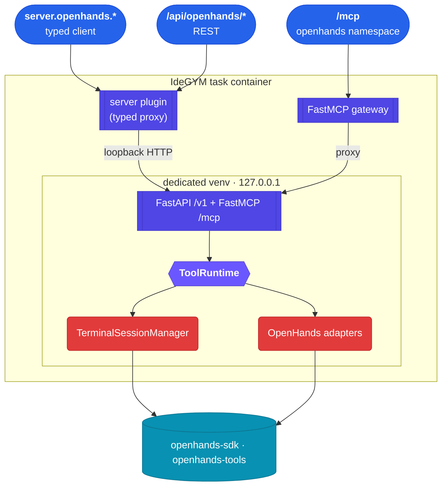

# OpenHands tools plugin

Exposes the agent-independent parts of
[`openhands-tools`](https://github.com/OpenHands/software-agent-sdk) through three IdeGYM surfaces —
REST (`/api/openhands/...`), MCP (`openhands` namespace), and a typed client (`server.openhands`) —
all backed by one runtime and one set of stateful terminals. No OpenHands agent, LLM, CLI, or
conversation loop: it reuses OpenHands' executors, tool definitions, action/observation models, MCP
schemas, and terminal sessions.

## Architecture



The service is loopback-only and runs in its **own in-container virtualenv**: OpenHands transitively
pins an older `opentelemetry-api` than IdeGYM, so the two cannot share an environment. IdeGYM only
proxies to it. See [`COMPATIBILITY.md`](./COMPATIBILITY.md).

## Layout

`plugins/openhands/` is part of the `idegym-plugins` distribution (package `idegym.plugins.openhands`,
same shape as `pycharm`/`idea`):

- `api/` — lightweight Pydantic contract (no OpenHands/FastAPI imports; safe for the client).
- `runtime/` — `ToolRuntime`, catalog, scheduler, artifacts, adapters, terminals; `compat.py` is the
  only module that imports `openhands.*`.
- `service/` — the loopback FastAPI + FastMCP app, entrypoint, and build-time smoke check.
- `image.py` / `server.py` / `client.py` — the image, server-proxy, and client plugin classes.
- `scripts/` — supervisor entry + start script (shipped in the wheel).

Entry points are declared in `plugins/pyproject.toml` under `idegym.plugins.{image,server,client}`.

## Terminal backends

`tmux` and `subprocess` are both created via OpenHands' `create_terminal_session` — one retained
session per handle (a pinned pane or a retained process, never a pool checkout). The backend is
chosen per terminal, reported in every result, and fixed for the handle's lifetime; a disabled or
unavailable backend errors explicitly, never falls back. **tmux is the reliable backend**: OpenHands'
subprocess terminal has an unreliable interrupt (upstream recommends installing tmux), so use tmux
when you need to interrupt long-running commands. A native retained-PTY subprocess shell is used only
when `openhands-tools` is absent (dev/CI) so the service still runs and is testable.

## Usage

```python
# image build — add on a base image that already includes the IdeGYM server (which provides
# idegym-plugins), the same way the pycharm/idea plugins are used. The dedicated venv installs the
# plugin runtime from that in-image source; no extra copy of the plugin source is needed.
from idegym.plugins.openhands.image import OpenHands

image = image.with_plugin(OpenHands())

# typed client
await server.openhands.health()
await server.openhands.call_tool("grep", {"pattern": "TODO", "path": "."})
term = await server.openhands.terminal(name="build", backend="tmux")
await term.execute("cd services/api && source .venv/bin/activate")
await term.execute("python -q")  # running=true on a soft timeout
await term.input("print(41 + 1)")  # -> 42
await term.input("C-d")
```

A `terminal_id` created on one surface is usable from the others — state lives in the runtime, not
the transport.

## Profiles

`core` (terminal + file/search/patch/Gemini tools), `full` (adds browser — classified, not yet
wired), `custom` (allow/deny lists). Agent-dependent families (`task`, `workflow`, `tom_consult`) are
reported `unsupported_requires_agent`; `delegate`/`preset`/`utils` `not_a_callable_tool`; a missing
optional dependency is `missing_dependency` — never silently omitted or faked.

## Testing

| Suite | Command | Notes |
|---|---|---|
| unit | `uv run pytest -m unit unit-tests/test_openhands_*.py` | native subprocess backend + in-process REST/MCP; no OpenHands needed |
| compat | `plugins/openhands/run-compat-tests.sh` | real OpenHands in an isolated venv (cannot share the IdeGYM env) |
| integration | `uv run pytest -m integration integration-tests/docker_tests/test_openhands_plugin.py` | real image build (Docker) |
| e2e | `uv run pytest -m e2e e2e-tests/test_openhands.py` | build + deploy + all three surfaces (CI/minikube) |
