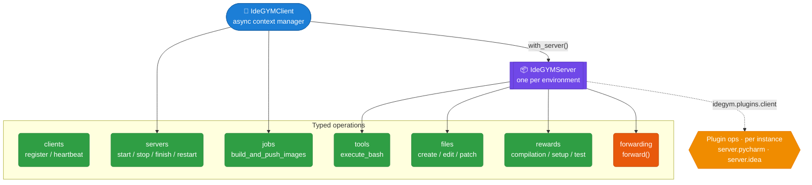

# Client

The `idegym-client` package is the **programmatic front door**. It handles
authentication, client registration, server lifecycle, and every operation on a running
environment — all async. Agents that prefer tools over code can use the orchestrator's
[MCP interface](/reference/mcp) instead; both reach the same handlers.

## Client surface (click a node for source)



## `IdeGYMClient`

The entry point, used as an **async context manager**: entering registers the client with
the orchestrator; exiting deregisters it and stops its servers.

```python
async with IdeGYMClient(
    orchestrator_url="https://idegym.example.com",
    name="my-training-run",
    namespace="idegym",
    auth=BasicAuth(username="admin", password="..."),
) as client:
    async with client.with_server(image_tag="...", server_name="s1") as server:
        result = await server.execute_bash("echo hello")
```

Key methods: `with_server(...)` (start + auto-cleanup), explicit `start_server` /
`stop_server` / `finish_server`, `jobs.build_and_push_images(...)`, and `health_check()`.
The `reuse_strategy` (`NONE` / `RESTART` / `RESET`) and `close_action` (`FINISH` / `STOP`)
control reuse — central to fast RL episodes.

## `IdeGYMServer`

Returned by `with_server()` / `start_server()`. It exposes the environment's operations:

- **Tools** — `execute_bash`, `create_file`, `edit_file`, `patch_file`, `reset_project`.
- **Rewards** — `compilation_reward`, `setup_reward`, `test_reward`.
- **Lifecycle** — `restart_server`, `list_capabilities` (the runtime plugin list).
- **OpenEnv** — `openenv_url` for WebSocket/OpenEnv-compatible access.

## Plugin operations & `forward()`

When `IdeGYMServer` is constructed it loads the `idegym.plugins.client` entry points and
attaches each as an attribute (hyphens → underscores), so an installed PyCharm plugin
gives you `server.pycharm.inspect(...)`. Each server instance gets its own ops objects.

For endpoints without a typed wrapper, the **escape hatch** is `forward()`:

```python
from idegym.api.tools.bash import BashCommandRequest

response = await server.forward(method="POST", path="tools/bash",
                                body=BashCommandRequest(command="echo hi", timeout=30.0))
```

It delegates to the same `ForwardingOperations` every typed method uses, accepts any
Pydantic body, and returns the parsed JSON. See [plugins](/architecture/plugins) for how
the three plugin hook points line up.

## View source

- `IdeGYMClient` → [`client/src/idegym/client/client.py`](https://github.com/JetBrains-Research/idegym/blob/main/client/src/idegym/client/client.py)
- `IdeGYMServer` + plugin ops loop → [`client/src/idegym/client/server.py`](https://github.com/JetBrains-Research/idegym/blob/main/client/src/idegym/client/server.py)
- Operations → [`client/src/idegym/client/operations/`](https://github.com/JetBrains-Research/idegym/tree/main/client/src/idegym/client/operations)
- Full reference → [Client Library docs](/reference/client)
