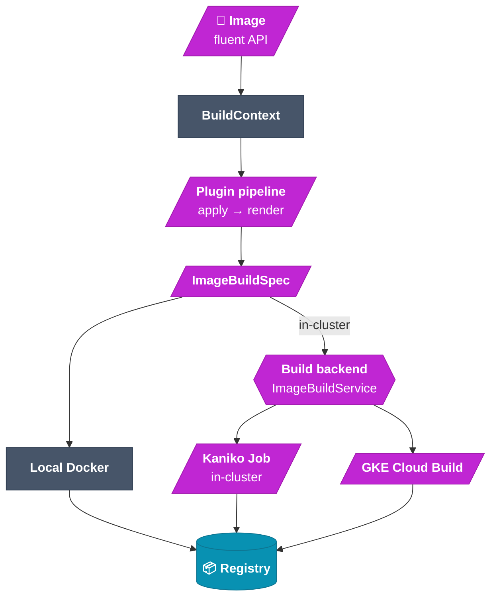
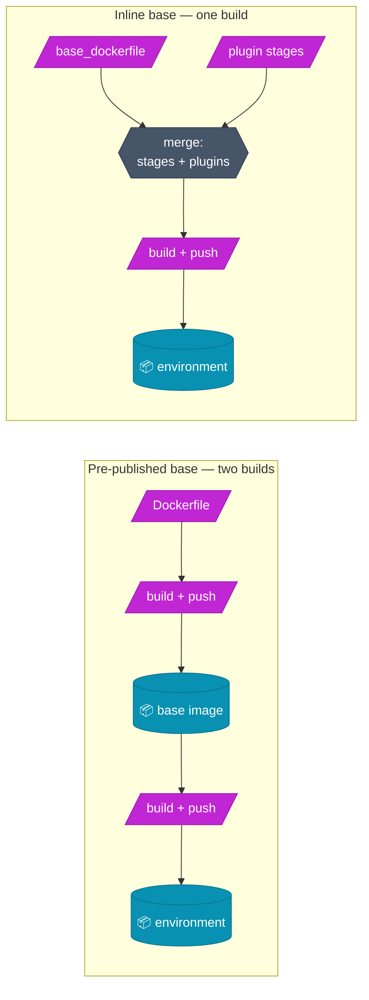

# Image builder

The image builder turns a **declarative description** of an environment into a real
container image. Instead of hand-writing Dockerfiles, you compose an `Image` from
**plugins**; each plugin updates a shared build context and emits a Dockerfile fragment.
The result is compiled to an `ImageBuildSpec` and built — locally with Docker, or
in-cluster through a **pluggable build backend** (Kaniko by default, or GKE Cloud Build).

## The build pipeline (click a node for source)



## How it works

`Image` is an **immutable** description: a base, an ordered list of plugins, optional trailing
shell commands, and runtime config (Kubernetes runtime class + resources). Every fluent
method returns a new `Image`.

The base is given **either** as an image reference (`base`) **or** as Dockerfile text
compiled in the same build (`base_dockerfile`) — see
[Basing on an inline Dockerfile](#basing-on-an-inline-dockerfile).

When you call `image.to_spec()`, the builder:

1. Normalizes `base_dockerfile`, if one was given: aliases the stage that acts as the base
   and hoists parser directives.
2. Creates a `BuildContext` whose `base` is that alias (or the image reference), with
   defaults (`current_user="root"`, `home="/root"`, `project_root="/root/work"`).
3. Walks the plugins **in order**, interleaving for each one:
   `apply(ctx)` → updates the context (e.g. the `user` plugin sets `current_user`), then
   `render(ctx)` → returns a Dockerfile fragment.
4. Assembles the final Dockerfile (hoisted directives, the user's own stages, plugin build
   stages, `FROM`, download ARGs, `ENV`s, all fragments, the final `USER`, the commands
   block) and any MCP-upstream config files into an `ImageBuildSpec`.

> **Plugin order matters.** Because `apply()` and `render()` are interleaved, a plugin's
> `render()` only sees context set by itself and earlier plugins. Put `user` before the
> plugins that should run as that user.

```python
from idegym.image.builder import Image
from idegym.plugins.defaults.image import BaseSystem, User, Project, IdeGYMServer

image = (
    Image.from_base("debian:bookworm-slim")
    .with_plugin(BaseSystem())  # apt packages
    .with_plugin(User(username="appuser", uid=1000, gid=1000))
    .with_plugin(IdeGYMServer.from_git(url=..., ref="main"))
    .with_plugin(Project.from_git(url=..., ref="abc123", owner="appuser"))
)
spec = image.to_spec()  # → ImageBuildSpec (inspect spec.dockerfile_content)
```

## Basing on an inline Dockerfile

A custom base used to mean a **separate build-and-push cycle** before the real build: registry
write credentials for every environment author, a second async build the orchestrator did not
track, and an intermediate image with no lifecycle owner. `base_dockerfile` removes that round
trip by compiling the base into the *same* build.



The merge emits your text **verbatim apart from one edit**: the stage acting as the base gains an
`AS idegym_base` alias, and only if it does not already declare one — renaming your stage would
break your own `COPY --from=` references. `FROM idegym_base` then inherits that stage's full image
config (`ENV`, `WORKDIR`, `USER`, `ENTRYPOINT`, `CMD`), which is what makes this **equivalent** to
publishing the base and referencing it by tag.

Inputs that cannot work are rejected **before** a build is submitted — a missing `FROM`, an unknown
`base_stage`, a stage in the reserved `idegym_` namespace, BuildKit-only syntax on Kaniko — rather
than surfacing minutes later in a build log.

### Build context by reference

An inline Dockerfile that `COPY`s from a build context needs one. `context_uri` names an archive the
caller has already staged (`gs://…`), so **the orchestrator never receives context bytes over the
API**. Kaniko fetches it natively as its `--context`; Cloud Build overlays it into the workspace with
a fetch step, deliberately *not* clobbering the generated Dockerfile or plugin assets.

> **Deduplication still holds.** The tag is a pure function of the definition, so two identical
> submissions produce the same tag and the second is a tag hit rather than a rebuild. Because the
> tag derives from the context *URI* rather than its bytes, callers must name context objects by
> content. See [build cost and deduplication](/reference/image_builder#build-cost-and-deduplication).

## Built-in image plugins

| Type | Class | Role |
|---|---|---|
| `base-system` | `BaseSystem` | Install apt packages (or a `minimal` set) |
| `user` | `User` | Create a Linux user/group; updates `ctx.current_user` |
| `permissions` | `Permissions` | `chown` / `chmod` paths |
| `project` | `Project` | Load a project: git, resource, local `COPY`, archive, or `git-clone` |
| `mcp-upstream` | `MCPUpstream` | Declare an in-pod MCP server URL |
| `idegym-server` | `IdeGYMServer` | Install the IdeGYM server runtime (`from_local` / `from_git`) |
| `pycharm` / `idea` | `PyCharm` / `Idea` | Install a JetBrains IDE (optional plugin extras) |

Plugins are discovered via the `idegym.plugins.image` entry-point group at import time,
so YAML deserialization always sees a populated registry. See
[plugins](/architecture/plugins) for how to write your own.

## Building: local vs. in-cluster

- **Local Docker** — `image.build()` uses the local Docker daemon; handy for development
  and loading into Minikube. Defaults to a **native single-platform build** (your host's
  architecture); pass `--multiplatform` only when you deliberately want `linux/amd64` +
  `linux/arm64`.
- **In-cluster** — serialize to YAML and submit to the orchestrator, which runs the build
  through a **pluggable backend** (below) and pushes the result to the configured registry.

### Shipping files a plugin `COPY`s

A plugin whose `render()` emits a `COPY` needs its source to exist in the build context.
Rather than assume the caller builds from a checkout of the idegym repo, a plugin ships the
file inside its own package and declares it from `get_context_files()` (`dest → packaged
file`); `to_spec()` folds these onto `ImageBuildSpec.context_files` and into the image tag,
so an asset change yields a new tag. The local Docker build **stages any missing declared
files in place** into the caller's context (cleaning up only what it created), so `COPY`
resolves from any working directory. See [Plugin system](/architecture/plugins) and the
[reference](/reference/plugins#shipping-files-your-copy-needs-get_context_files).

### Build backends

The in-cluster path is **backend-agnostic**: the orchestrator picks an `ImageBuilder` at
request time and a shared `ImageBuildService` drives it — build the tag, persist status to
the `job_statuses` table, and poll to completion. The backend is selected via config
(`IDEGYM_BUILD_BACKEND`), **defaulting to `kaniko`** so existing deployments are unchanged.

- **Kaniko** (default) — an in-cluster Job that builds from `dockerfile_content` (mounted
  as a ConfigMap) and pushes to the registry; download ARGs (project URL, auth token) are
  passed as `--build-arg` values. Kaniko accepts a **single** `--context`, which is why a
  caller-supplied `context_uri` and the git checkout that resolves plugin `context_files`
  cannot be combined here. When a spec carries `context_files` and no `context_uri`, the Job's
  context is a **git checkout of the idegym repo** at the orchestrator's version, so those
  `COPY` paths resolve.
- **GKE Cloud Build** — builds with [GCP Cloud Build](https://cloud.google.com/build)
  (BuildKit) instead of an in-cluster Job, pushing to Artifact Registry. The project auth
  token is passed as a BuildKit **build secret** (never a `--build-arg`), so it never lands
  in the Build request, its logs, or the image history. Plugin `context_files` travel in the
  uploaded context tar, and a caller `context_uri` is overlaid by a preceding fetch step, so
  both can coexist.

Capability differences are **validated up front and reported as errors**, never discovered from a
build log. The ones that matter: BuildKit-only Dockerfile syntax (heredocs, `RUN --mount`) is Cloud
Build only; `machine_type` / `disk_size_gb` are Cloud Build only, since a Kaniko build is sized by
the per-image `resources` field; and `secrets` become real secret mounts on Cloud Build but
`--build-arg` values on Kaniko, which **exposes them in the image history**.

> **Kaniko + `set -u` gotcha:** ARGs without a `--build-arg` value are **unset** (not
> empty). IdeGYM's `RUN set -eux;` uses `set -u`, so optional ARGs are referenced as
> `${VAR:-}`. The built-in plugins handle this for you.

→ Full backend configuration (env vars, GCP IAM), the complete
[capability matrix](/reference/image_builder#backend-capability-matrix), and the
[secret-handling caveats](/reference/image_builder#build-secrets-across-backends) are in the
[reference — build backends](/reference/image_builder#build-backends).

## View source

- Fluent API → [`image-builder/src/idegym/image/builder.py`](https://github.com/JetBrains-Research/idegym/blob/main/image-builder/src/idegym/image/builder.py)
- Built-in plugins → [`plugins/defaults/src/idegym/plugins/defaults/image.py`](https://github.com/JetBrains-Research/idegym/blob/main/plugins/defaults/src/idegym/plugins/defaults/image.py)
- Spec model → [`api/src/idegym/api/image_build.py`](https://github.com/JetBrains-Research/idegym/blob/main/api/src/idegym/api/image_build.py)
- Build backends → [`backend-utils/src/idegym/backend/utils/image_builder/`](https://github.com/JetBrains-Research/idegym/tree/main/backend-utils/src/idegym/backend/utils/image_builder)
- Full reference → [Image Builder docs](/reference/image_builder)
