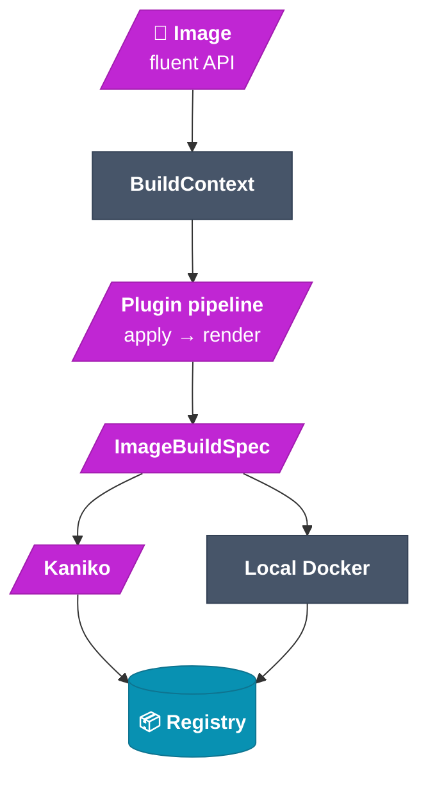

# Image builder

The image builder turns a **declarative description** of an environment into a real
container image. Instead of hand-writing Dockerfiles, you compose an `Image` from
**plugins**; each plugin updates a shared build context and emits a Dockerfile fragment.
The result is compiled to an `ImageBuildSpec` and built — locally with Docker, or
in-cluster with Kaniko.

## The build pipeline (click a node for source)



## How it works

`Image` is an **immutable** description: a base image, an ordered list of plugins,
optional trailing shell commands, and runtime config (Kubernetes runtime class +
resources). Every fluent method returns a new `Image`.

When you call `image.to_spec()`, the builder:

1. Creates a `BuildContext` with defaults (`current_user="root"`, `home="/root"`,
   `project_root="/root/work"`).
2. Walks the plugins **in order**, interleaving for each one:
   `apply(ctx)` → updates the context (e.g. the `user` plugin sets `current_user`), then
   `render(ctx)` → returns a Dockerfile fragment.
3. Assembles the final Dockerfile (`FROM`, download ARGs, `ENV`s, all fragments, the
   final `USER`, the commands block) and any MCP-upstream config files into an
   `ImageBuildSpec`.

> **Plugin order matters.** Because `apply()` and `render()` are interleaved, a plugin's
> `render()` only sees context set by itself and earlier plugins. Put `user` before the
> plugins that should run as that user.

```python
from idegym.image.builder import Image
from idegym.plugins.defaults.image import BaseSystem, User, Project, IdeGYMServer

image = (
    Image.from_base("debian:bookworm-slim")
    .with_plugin(BaseSystem())                       # apt packages
    .with_plugin(User(username="appuser", uid=1000, gid=1000))
    .with_plugin(IdeGYMServer.from_git(url=..., ref="main"))
    .with_plugin(Project.from_git(url=..., ref="abc123", owner="appuser"))
)
spec = image.to_spec()        # → ImageBuildSpec (inspect spec.dockerfile_content)
```

## Built-in image plugins

| Type | Class | Role |
|---|---|---|
| `base-system` | `BaseSystem` | Install apt packages (or a `minimal` set) |
| `user` | `User` | Create a Linux user/group; updates `ctx.current_user` |
| `permissions` | `Permissions` | `chown` / `chmod` paths |
| `project` | `Project` | Load a project: git, resource, local `COPY`, archive, or `git-clone` |
| `mcp-upstream` | `MCPUpstream` | Declare an in-pod MCP server URL |
| `idegym-server` | `IdeGYMServer` | Install the IdeGYM server runtime (`from_local` / `from_git`) |
| `pycharm` / `idea` | `PyCharm` / `Idea` | Install a JetBrains IDE (optional plugin extras) |

Plugins are discovered via the `idegym.plugins.image` entry-point group at import time,
so YAML deserialization always sees a populated registry. See
[plugins](/architecture/plugins) for how to write your own.

## Building: local vs. in-cluster

- **Local Docker** — `image.build()` uses the local Docker daemon; handy for development
  and loading into Minikube.
- **Kaniko (in-cluster)** — serialize to YAML, submit to the orchestrator, which runs a
  Kaniko Job that builds from `dockerfile_content` and pushes to the configured registry.
  Download ARGs (project URL, auth token) are passed as `--build-arg` values.

> **Kaniko + `set -u` gotcha:** ARGs without a `--build-arg` value are **unset** (not
> empty). IdeGYM's `RUN set -eux;` uses `set -u`, so optional ARGs are referenced as
> `${VAR:-}`. The built-in plugins handle this for you.

## View source

- Fluent API → [`image-builder/src/idegym/image/builder.py`](https://github.com/JetBrains-Research/idegym/blob/main/image-builder/src/idegym/image/builder.py)
- Built-in plugins → [`plugins/defaults/src/idegym/plugins/defaults/image.py`](https://github.com/JetBrains-Research/idegym/blob/main/plugins/defaults/src/idegym/plugins/defaults/image.py)
- Spec model → [`api/src/idegym/api/image_build.py`](https://github.com/JetBrains-Research/idegym/blob/main/api/src/idegym/api/image_build.py)
- Full reference → [Image Builder docs](/reference/image_builder)
