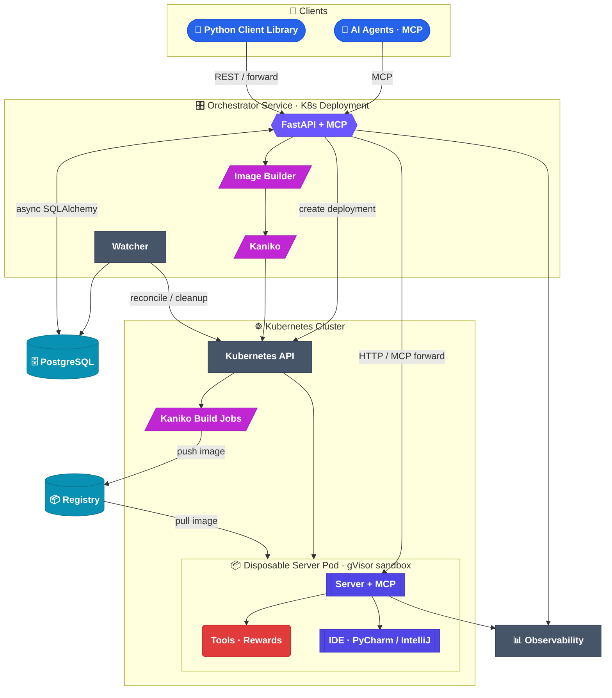

# Architecture

This is the centerpiece. The diagram below is the **whole system** — and every component
is **clickable**. Click a node to drill into its deep-dive page; each of those pages has
its own diagram that drills further, down to the source on GitHub.

## System overview (click any node)

<small><em>Underlined nodes are clickable; dashed boxes are groupings. (Adapted from
[`website/docs/reference/diagrams/architecture.md`](https://github.com/JetBrains-Research/idegym/blob/main/website/docs/reference/diagrams/architecture.md).)</em></small>

## Component map

| Component | What it does | Deep dive |
|---|---|---|
| **Orchestrator** | FastAPI control plane: lifecycle, state, forwarding | [Orchestrator →](/architecture/orchestrator) |
| **Image Builder / Kaniko** | Compose images from plugins, build in-cluster | [Image builder →](/architecture/image-builder) |
| **Server Pod** | Sandboxed FastAPI environment + MCP gateway | [Server →](/architecture/server) |
| **Clients** | Python client library + MCP access for agents | [Client →](/architecture/client) |
| **Plugins** | Image / server / client extension points | [Plugins →](/architecture/plugins) |
| **Watcher** | Cleanup / reconcile loop | [Watcher →](/architecture/watcher) |
| **Rewards & Tools** | What agents do & how they're scored | [Rewards & tools →](/architecture/rewards-tools) |
| **PostgreSQL** | Clients, servers, jobs, snapshots | [Orchestrator →](/architecture/orchestrator) |
| **Registry & Observability** | Image storage, metrics & traces | [Deployment →](/deployment) |

## The key flows

1. **Build image** — orchestrator compiles an `Image` (plugins) → build spec → Kaniko job
   → image pushed to the registry.
2. **Provision** — orchestrator creates a Kubernetes Deployment; the pod pulls the image
   and boots Supervisor → FastAPI server (and any in-pod IDE).
3. **Use** — client/agent requests are forwarded by the orchestrator into the server
   pod's HTTP / MCP endpoints; tools execute inside the sandbox.
4. **Clean up** — the watcher reconciles database state with the cluster and tears down
   stale resources.

---

**New to IdeGYM?** Read the [core concepts](/overview/concepts) first, then the
[end-to-end data flow](/overview/data-flow).
