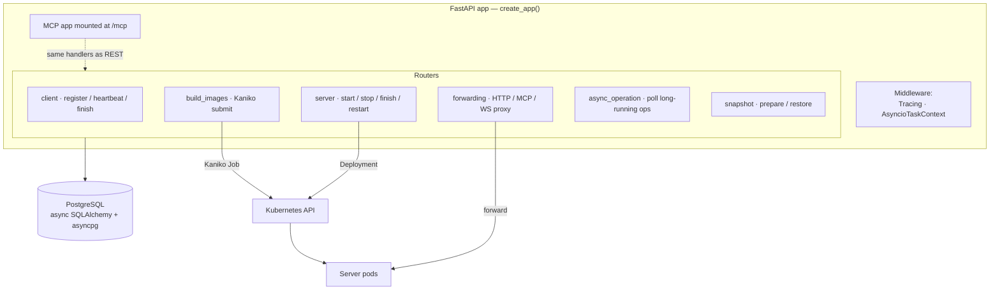

# Orchestrator

The orchestrator is the **control plane** and the single entry point for everything.
It's a FastAPI service (deployed as a Kubernetes Deployment) that registers clients,
builds images, provisions and tears down environment pods, forwards traffic into them,
and persists all state in PostgreSQL.

## Inside the orchestrator (click a node for source)

## Responsibilities

- **Client lifecycle** — register a client (with optional node pre-provisioning), track
  heartbeats, and on stop/finish tear down or release its servers.
- **Server lifecycle** — start (or **reuse** a matching finished server), stop, finish
  (release for reuse), and restart environment pods, waiting for readiness.
- **Image builds** — accept image-builder YAML, compile each `Image` to a spec, and
  submit Kaniko jobs to the cluster (see [image builder](/architecture/image-builder)).
- **Forwarding** — proxy HTTP, MCP, and WebSocket requests from clients into the right
  server pod, and **persist** every request/response for offline reward computation.
- **Async operations** — long-running calls return an operation ID the client polls to
  completion; this keeps connections short and the API responsive.
- **Snapshots** — on GKE, prepare and restore pod snapshots to skip cold-start work.

## Key building blocks

| Concern | Where | Notes |
|---|---|---|
| App assembly | [`main.py`](https://github.com/JetBrains-Research/idegym/blob/main/orchestrator/src/idegym/orchestrator/main.py) | `create_app()` builds the app, combines the FastAPI + MCP lifespans, mounts routers, instruments OpenTelemetry |
| MCP server | [`mcp.py`](https://github.com/JetBrains-Research/idegym/blob/main/orchestrator/src/idegym/orchestrator/mcp.py) | A thin FastMCP layer over the **same** handlers as REST — no separate state |
| Routers | [`router/`](https://github.com/JetBrains-Research/idegym/tree/main/orchestrator/src/idegym/orchestrator/router) | One module per concern: `client`, `server`, `build_images`, `forwarding`, `async_operation`, `snapshot`, `dashboard`, `diagnostics` |
| State | [`database/`](https://github.com/JetBrains-Research/idegym/tree/main/orchestrator/src/idegym/orchestrator/database) | Async SQLAlchemy + asyncpg; Alembic migrations run on startup |
| Kaniko submit | [`kubernetes_client.py`](https://github.com/JetBrains-Research/idegym/blob/main/backend-utils/src/idegym/backend/utils/kubernetes_client.py) | Creates Kaniko Jobs and server Deployments via the K8s API |

## Persistence model

PostgreSQL holds **clients**, **servers**, **build jobs**, **async operations**, and
**snapshots**. Because the orchestrator stores every forwarded request and response, an
evaluation harness can recompute rewards offline and reproduce runs without re-executing
them. Concurrency-sensitive operations use real Postgres features — `FOR UPDATE SKIP
LOCKED` and advisory locks — to coordinate the watcher and request handlers safely.

## Configuration

Configuration is managed with [Hydra](https://hydra.cc/) (`load_config()` composes
`hydra_configs/config`). Notable knobs include database connection, connection limits,
asyncio debug/dump, the MCP `stateless_http` mode, and node-pool scheduling. See
[deployment](/deployment) for the environment variables and Helm values that drive these.

## View source

- App & router wiring → [`orchestrator/src/idegym/orchestrator/main.py`](https://github.com/JetBrains-Research/idegym/blob/main/orchestrator/src/idegym/orchestrator/main.py)
- Orchestrator package → [`orchestrator/`](https://github.com/JetBrains-Research/idegym/tree/main/orchestrator)
- REST reference → [`orchestrator/README.md`](https://github.com/JetBrains-Research/idegym/blob/main/orchestrator/README.md) · interactive → [API](/api)
