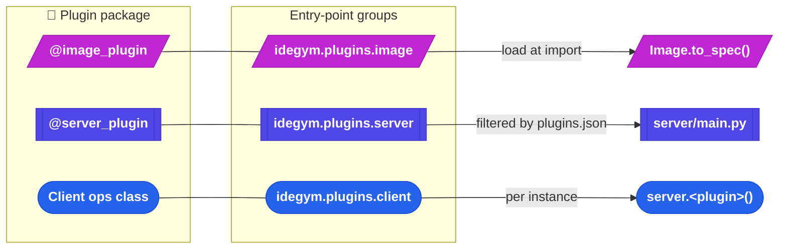

# Plugin system

IdeGYM's extensibility rests on **one idea**: a single plugin package can hook into three
distinct integration points. Each is optional, discovered via its own entry-point group,
and consumed by a different part of the system. The PyCharm and IntelliJ IDEA integrations
are the canonical examples; the built-in defaults (`base-system`, `user`, `project`,
`tools`, `rewards`) are plugins too.

## The three hook points (click a node for source)

<small><em>Adapted from
[`website/docs/reference/diagrams/plugins.md`](https://github.com/JetBrains-Research/idegym/blob/main/website/docs/reference/diagrams/plugins.md).</em></small>

## The integration points

| Hook | How you opt in | Where it's consumed | What you get |
|---|---|---|---|
| **Image** | `@image_plugin("name")` + `apply()` / `render()` | `Image.to_spec()` ([image builder](/architecture/image-builder)) | A Dockerfile fragment |
| **MCP upstream** | `get_mcp_upstream()` on the image plugin | `Image.to_spec()` (auto-writes config) | `/etc/idegym/mcp-upstreams.d/<name>.json` |
| **Server** | `@server_plugin` + `get_server_router()` | `server/main.py` at startup | An `APIRouter` at `/api/<plugin>/*` |
| **Client** | `idegym.plugins.client` entry point | `IdeGYMServer.__init__` | `server.<plugin>.<method>()` |

Every method has a no-op default, so a plugin implements only the points it needs.

The shared base lives in [`api/src/idegym/api/plugin.py`](https://github.com/JetBrains-Research/idegym/blob/main/api/src/idegym/api/plugin.py)
— `PluginBase`, `BuildContext`, and both registries (`@image_plugin`, `@server_plugin`).
The `api` package is a lightweight dependency the image builder, server, and client all
import without creating cycles.

## MCP upstream convention

A plugin that runs an MCP server inside the container declares its URL with
`get_mcp_upstream()`. When `Image.to_spec()` sees a non-`None` URL it auto-emits a
Dockerfile instruction writing `/etc/idegym/mcp-upstreams.d/<name>.json`. At runtime the
[server's MCP gateway](/architecture/server) discovers those files and proxies each
upstream under its stem as a namespace — that's how an IDE's MCP tools surface as
`pycharm_*` / `idea_*` through the IdeGYM server.

## Discovery & configuration

- `idegym.plugins.image` — loaded at **import time** (registry ready before YAML parsing).
- `idegym.plugins.server` — loaded at server startup, **filtered by**
  `/etc/idegym/plugins.json` (`{"server": ["tools", "rewards", "pycharm"]}`). Absent file
  ⇒ load everything (development).
- `idegym.plugins.client` — loaded **per `IdeGYMServer` instance**; failures are isolated
  per plugin.

## Built-in plugins

| Distribution | Plugins |
|---|---|
| `idegym-plugins` (defaults, always installed) | `base-system`, `user`, `permissions`, `mcp-upstream`, `project`, `idegym-server`, `tools`, `rewards` |
| `idegym-plugins[pycharm]` | `PyCharm` (image) + `PyCharmPlugin` (server) + `PycharmClientOperations` (client) |
| `idegym-plugins[idea]` | `Idea` (image) + `IdeaPlugin` (server) + `IdeaClientOperations` (client) |

## View source

- Plugin base & registries → [`api/src/idegym/api/plugin.py`](https://github.com/JetBrains-Research/idegym/blob/main/api/src/idegym/api/plugin.py)
- Built-in defaults → [`plugins/defaults/`](https://github.com/JetBrains-Research/idegym/tree/main/plugins/defaults)
- PyCharm / IDEA extras → [`plugins/pycharm/`](https://github.com/JetBrains-Research/idegym/tree/main/plugins/pycharm) · [`plugins/idea/`](https://github.com/JetBrains-Research/idegym/tree/main/plugins/idea)
- Authoring guide → [Plugin Architecture docs](/reference/plugins)
