# Rewards & tools

This page answers two questions an RL or agent researcher actually has: **what can the
agent do inside an environment, and how do we score it?** Tools are the *actions*;
rewards are the *signal*.

## Act, then score (click a node for source)

```mermaid
flowchart LR
    subgraph tools["🛠️ Tools — what the agent does"]
        bash("bash · execute a script"):::tool
        cf("create_file"):::tool
        ef("edit_file · line range"):::tool
        pf("patch_file · unified diff"):::tool
        inspect("IDE inspect · IDE plugins"):::tool
    end

    subgraph rewards["🎯 Rewards — how it's scored"]
        comp[/"compilation_reward<br/>pass / fail"/]:::build
        setup[/"setup_reward<br/>pass / fail"/]:::build
        test[/"test_reward<br/>passed / failed counts"/]:::build
    end

    agent(["🤖 Agent / trainer"]):::client --> tools --> env[["📦 Sandbox state"]]:::pod
    env --> rewards --> signal{{"📈 Training signal"}}:::ctrl

    classDef tool fill:#2f9e44,stroke:#2b8a3e,color:#fff;
    classDef build fill:#f08c00,stroke:#e67700,color:#fff;
    classDef client fill:#1c7ed6,stroke:#1864ab,color:#fff;
    classDef pod fill:#7048e8,stroke:#5f3dc4,color:#fff;
    classDef ctrl fill:#e8590c,stroke:#c04405,color:#fff;

    click bash "https://github.com/JetBrains-Research/idegym/blob/main/tools/src/idegym/tools/tool_service.py" "tool service source"
    click cf "https://github.com/JetBrains-Research/idegym/blob/main/tools/src/idegym/tools/file_manager.py" "file manager source"
    click ef "https://github.com/JetBrains-Research/idegym/blob/main/tools/src/idegym/tools/file_manager.py" "file manager source"
    click pf "https://github.com/JetBrains-Research/idegym/blob/main/tools/src/idegym/tools/file_manager.py" "file manager source"
    click inspect "https://github.com/JetBrains-Research/idegym/blob/main/plugins/pycharm/src/idegym/plugins/pycharm/server.py" "IDE inspect plugin source"
    click comp "https://github.com/JetBrains-Research/idegym/blob/main/rewards/src/idegym/rewards/compilation_checker.py" "compilation checker source"
    click setup "https://github.com/JetBrains-Research/idegym/blob/main/rewards/src/idegym/rewards/setup_checker.py" "setup checker source"
    click test "https://github.com/JetBrains-Research/idegym/blob/main/rewards/src/idegym/rewards/test_checker.py" "test checker source"
```



## Tools — the action space

Every server ships the **tools** plugin, available on all images:

| Tool | Endpoint | What it does |
|---|---|---|
| Bash | `POST /api/tools/bash` | Run a bash script; returns stdout/stderr/exit code |
| Create file | `POST /api/tools/file/create` | Create a file with given content |
| Edit file | `POST /api/tools/file/edit` | Replace a 1-indexed, inclusive line range |
| Patch file | `POST /api/tools/file/patch` | Apply a unified diff |

The three file tools are **also exposed as MCP tools** (`create_file`, `edit_file`,
`patch_file`) on the server's `/mcp` endpoint. With a JetBrains IDE plugin installed, an
`inspect` endpoint runs the full IntelliJ static-analysis pipeline, and **mcp-steroid**
exposes the IntelliJ Platform API (PSI, refactoring, debugger, VCS) as MCP tools. See the
[tools reference](/reference/tools).

```python
result = await server.execute_bash("python -m pytest -q")
await server.patch_file("/home/devuser/project/main.py", patch="--- ...")
```

## Rewards — the evaluation signal

Three reward kinds turn the environment's state into a number an RL loop can train on.
Each runs a script **inside the sandbox** and returns a structured result.

| Reward | Call | Result |
|---|---|---|
| Compilation | `server.compilation_reward(compilation_script=...)` | `.success` (bool) |
| Setup | `server.setup_reward(setup_check_script=...)` | `.success` (bool) |
| Test | `server.test_reward(test_script=...)` | `.passed`, `.failed`, `.output` |

```python
result = await server.test_reward(test_script="cd /project && python -m pytest -q")
score = result.passed / (result.passed + result.failed)
```

Because the [orchestrator](/architecture/orchestrator) **persists every forwarded
request and response**, rewards can also be recomputed offline from stored runs — making
evaluation reproducible.

## How an episode uses both

A typical RL episode: `start_server` with `reuse_strategy=RESET` → the agent acts via
**tools** → call a **reward** → release the server for reuse. The full sequence is on the
[data flow page](/overview/data-flow#the-rl--eval-inner-loop).

## View source

- Tool service & file ops → [`tools/src/idegym/tools/`](https://github.com/JetBrains-Research/idegym/tree/main/tools/src/idegym/tools)
- Reward checkers → [`rewards/src/idegym/rewards/`](https://github.com/JetBrains-Research/idegym/tree/main/rewards/src/idegym/rewards)
- Full reference → [Tools docs](/reference/tools) · [Client rewards](/reference/client)
