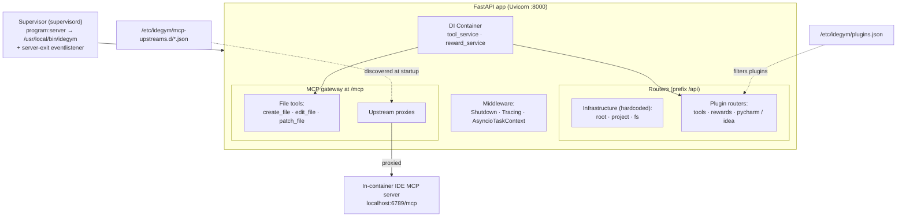

# Server (in-pod)

Each environment pod runs a small **FastAPI server** — the thing that actually executes
your bash commands, edits files, runs rewards, and (when an IDE is installed) proxies the
IDE's MCP server. Supervisor boots it; an MCP gateway fronts it.

## How a server process is assembled (click a node for source)

<small><em>Adapted from
[`documentation/diagrams/server.md`](https://github.com/JetBrains-Research/idegym/blob/main/documentation/diagrams/server.md).</em></small>

## Assembly (`server/main.py`)

1. **Plugin loading** — read `/etc/idegym/plugins.json` to decide which
   `idegym.plugins.server` entry points to load (dev fallback: load everything installed).
2. **App + MCP gateway** — build the FastMCP server, expose it as an ASGI app, and combine
   its lifespan with the FastAPI lifespan.
3. **Middleware** — `ShutdownMiddleware`, `TracingMiddleware`, `AsyncioTaskContextMiddleware`.
4. **Dependency injection** — a `Container` provides `tool_service` and `reward_service`,
   wired into the routers via `app.dependency_overrides`.
5. **Routers** — infrastructure routers (`root`, `project`, `fs`) mount unconditionally;
   plugin routers come from `get_all_server_plugins()` and mount only when
   `get_server_router()` is non-`None`. All use the `/api` prefix.
6. **MCP mount** — the MCP gateway mounts at `/mcp`.
7. **Instrumentation** — Asyncio, system metrics, HTTPX, FastAPI, and Uvicorn OpenTelemetry
   instrumentors attach.

## MCP gateway (`server/mcp_proxy.py`)

- Always exposes built-in file tools: `create_file`, `edit_file`, `patch_file`.
- Scans `/etc/idegym/mcp-upstreams.d/*.json` at startup; for each entry it builds a proxy
  (`create_proxy(url)`) and mounts it under the file's stem as a namespace. This is how an
  in-pod IDE's MCP server (e.g. `localhost:6789/mcp`) becomes reachable **through** the
  IdeGYM server, namespaced (e.g. `pycharm_*`).

## Process supervision (`supervisord.conf`)

- `program:server` runs `/usr/local/bin/idegym` (the Uvicorn entrypoint).
- A `server-exit` eventlistener watches the server and kills Supervisor when it exits, so
  the pod terminates cleanly.
- Additional programs (e.g. an IDE) are included via `/etc/supervisor/conf.d/*.conf`.

## How requests get here

You never reach the pod directly. The [orchestrator](/architecture/orchestrator) forwards
HTTP / MCP / WebSocket requests into the pod's service. Inside, the
[tools and rewards](/architecture/rewards-tools) do the work.

## View source

- App assembly → [`server/main.py`](https://github.com/JetBrains-Research/idegym/blob/main/server/main.py)
- MCP gateway → [`server/mcp_proxy.py`](https://github.com/JetBrains-Research/idegym/blob/main/server/mcp_proxy.py)
- Supervisor config → [`supervisord.conf`](https://github.com/JetBrains-Research/idegym/blob/main/supervisord.conf)
- Server package → [`server/`](https://github.com/JetBrains-Research/idegym/tree/main/server)
