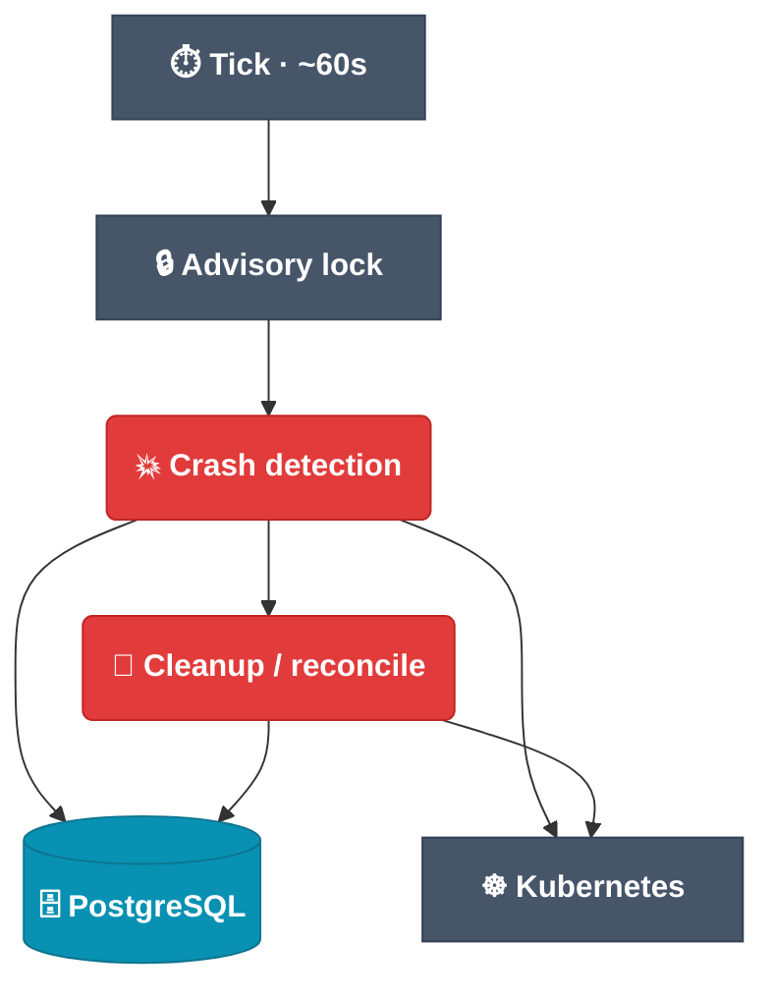

# Watcher

Disposable environments only stay cheap if dead ones actually go away. The **watcher** is
the background loop that guarantees this: it periodically reconciles the database against
the live Kubernetes cluster, evicts stale or crashed servers, and reclaims quota — with
no manual teardown.

## The reconcile loop (click a node for source)

## What it does each tick

Under a Postgres **advisory lock** (so only one reconciler runs at a time), the watcher runs
these steps in order, each swallowing and logging its own errors:

1. **Detects crashed servers.** Sandbox pods run with `restartPolicy: Always`, so a crashing
   container would otherwise restart forever silently. `evaluate_pod_crash(pod, max_restarts)`
   (a pure function) flags a pod whose restart count exceeds its budget, or that is `Failed` /
   `Evicted`. `detect_crashed_servers` lists pods **once per namespace** (label selector
   `app.kubernetes.io/component=sandbox`) — never per-server, no Events API.
2. **Tears down and records.** On a crash it deletes the pod first, then marks the server
   `CRASHED` (or `DELETION_FAILED` if teardown fails), recording the reason in the server's
   `details` column. The next client `forward` sees *why* in the 410 GONE detail.
3. **Times out idle servers and clients.** `ALIVE`/`REUSED` servers past `inactive_timeout` and
   `FINISHED` servers past `finished_timeout` have their pod deleted and become `KILLED`; idle
   clients release their nodes.
4. **Reconciles pods with the database** (`reconcile_pods_with_db`). It lists the sandbox pods
   and looks their server rows up by name in one query. A pod whose row is missing or terminal
   (`STOPPED`, `KILLED`, `DELETION_FAILED`, …) and that is older than `orphan_grace` is deleted;
   a `DELETION_FAILED` row is then finalized to `KILLED`, as is every `DELETION_FAILED` row
   that has no pod at all. This is the only path that revisits `DELETION_FAILED` rows, which
   the orchestrator writes when a stop fails to delete the pod. One summary line per tick
   reports pods scanned, orphans deleted, rows finalized and failures.
5. **Recounts quota** (`reconcile_resource_usage`). In one transaction it locks every
   `resource_limit_rules` row, assigns each `ALIVE`/`FINISHED`/`REUSED` server to its
   highest-priority matching rule (the same Postgres `~` match the orchestrator uses when
   admitting a server) and rewrites `used_cpu` / `used_ram` / `current_pods` where the stored
   value differs, logging the drift.
6. **Prunes request records and orphaned Kaniko jobs.**

Quota is released exactly once per server, on its first transition into a terminal status;
finalizing a `DELETION_FAILED` row does not release it again, and the recount corrects
anything that slipped through.

## Configuration

All fields live under `orchestrator.watcher` (`WatcherConfig`) and are read from the
environment:

| Env | Default | Effect |
| --- | --- | --- |
| `IDEGYM_WATCHER_CLEANUP_INTERVAL` | `PT60S` | Tick interval |
| `IDEGYM_WATCHER_INACTIVE_TIMEOUT` | `PT10M` | Idle `ALIVE`/`REUSED` servers and clients are killed after this |
| `IDEGYM_WATCHER_FINISHED_TIMEOUT` | `PT5M` | `FINISHED` servers not reused within this are killed |
| `IDEGYM_WATCHER_REQUEST_MAX_AGE` | `P14D` | Completed async operations older than this are deleted |
| `IDEGYM_WATCHER_REQUEST_STALE` | `PT24H` | `IN_PROGRESS` operations older than this are closed |
| `IDEGYM_WATCHER_ORPHAN_REAP_ENABLED` | `True` | Run the pod reconciliation (step 4) |
| `IDEGYM_WATCHER_ORPHAN_GRACE` | `PT2M` | Minimum pod age before a pod without a live row counts as an orphan |
| `IDEGYM_WATCHER_USAGE_RECONCILE_ENABLED` | `True` | Run the quota recount (step 5) |

Crash detection is gated on `WatcherConfig.crash_detection_enabled` (default on).

The watcher connects with the same `IDEGYM_SQLALCHEMY_*` settings as the orchestrator, including
the per-connection `IDEGYM_SQLALCHEMY_LOCK_TIMEOUT_MS`, `IDEGYM_SQLALCHEMY_STATEMENT_TIMEOUT_MS`
and `IDEGYM_SQLALCHEMY_IDLE_IN_TRANSACTION_TIMEOUT_MS`; give the watcher deployment a longer
statement timeout when `IDEGYM_WATCHER_REQUEST_MAX_AGE` deletes are large. It reports as
`idegym-watcher` in `pg_stat_activity` unless `IDEGYM_SQLALCHEMY_APPLICATION_NAME` is set.

## Restart budget

The crash policy is **per-server**: `StartServerRequest.max_restarts` (default `0` = fail
on first crash) is plumbed client → API → orchestrator → DB. It is **not** a global
orchestrator setting, so different workloads can tolerate different flakiness. Detection
latency is roughly one `cleanup_interval`.

## Why it's a separate component

Keeping reconciliation out of the request path means the orchestrator stays responsive
while a steady background process owns convergence. The watcher reads the same
[PostgreSQL](/architecture/orchestrator) state the orchestrator writes, and acts on the
same cluster the orchestrator provisions into.

## View source

- Loop → [`watcher/src/idegym/watcher/main.py`](https://github.com/JetBrains-Research/idegym/blob/main/watcher/src/idegym/watcher/main.py)
- Cleanup → [`watcher/src/idegym/watcher/cleanup.py`](https://github.com/JetBrains-Research/idegym/blob/main/watcher/src/idegym/watcher/cleanup.py)
- Pod and quota reconcile → [`watcher/src/idegym/watcher/reconcile.py`](https://github.com/JetBrains-Research/idegym/blob/main/watcher/src/idegym/watcher/reconcile.py)
- Crash detection → [`watcher/src/idegym/watcher/crash_detector.py`](https://github.com/JetBrains-Research/idegym/blob/main/watcher/src/idegym/watcher/crash_detector.py)
