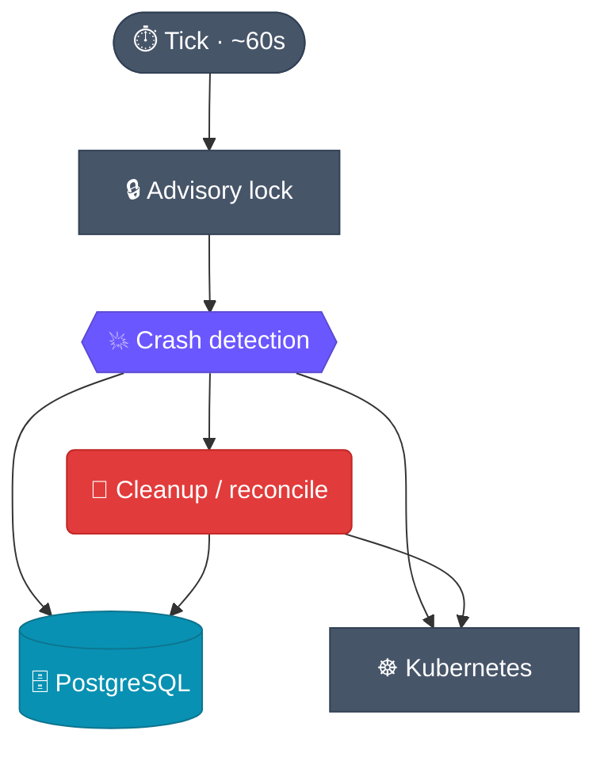

# Watcher

Disposable environments only stay cheap if dead ones actually go away. The **watcher** is
the background loop that guarantees this: it periodically reconciles the database against
the live Kubernetes cluster, evicts stale or crashed servers, and reclaims quota — with
no manual teardown.

## The reconcile loop (click a node for source)

## What it does each tick

Under a Postgres **advisory lock** (so only one reconciler runs at a time), the watcher:

1. **Detects crashed servers.** Server pods are Deployments forced to
   `restartPolicy: Always`, so a crashing container would otherwise restart forever
   silently. `evaluate_pod_crash(pod, max_restarts)` (a pure function) flags a pod whose
   restart count exceeds its budget, or that is `Failed` / `Evicted`. `detect_crashed_servers`
   lists pods **once per namespace** (label selector `app.kubernetes.io/part-of=idegym`)
   — never per-server, no Events API.
2. **Tears down and records.** On a crash it deletes the Deployment first, then marks the
   server `CRASHED` (or `DELETION_FAILED` if teardown fails), recording the reason in the
   server's `details` column. The next client `forward` sees *why* in the 410 GONE detail.
3. **Cleans up the rest.** It reconciles the database against live cluster state — evicting
   servers whose clients are gone and reclaiming orphaned resources — and frees quota.

## Restart budget

The crash policy is **per-server**: `StartServerRequest.max_restarts` (default `0` = fail
on first crash) is plumbed client → API → orchestrator → DB. It is **not** a global
orchestrator setting, so different workloads can tolerate different flakiness. Detection
latency is roughly one `cleanup_interval`.

Crash detection is gated on `WatcherConfig.crash_detection_enabled` (default on) and runs
**first** within `perform_cleanup_operations`, under the same advisory lock as the rest of
cleanup.

## Why it's a separate component

Keeping reconciliation out of the request path means the orchestrator stays responsive
while a steady background process owns convergence. The watcher reads the same
[PostgreSQL](/architecture/orchestrator) state the orchestrator writes, and acts on the
same cluster the orchestrator provisions into.

## View source

- Loop → [`watcher/src/idegym/watcher/main.py`](https://github.com/JetBrains-Research/idegym/blob/main/watcher/src/idegym/watcher/main.py)
- Cleanup / reconcile → [`watcher/src/idegym/watcher/cleanup.py`](https://github.com/JetBrains-Research/idegym/blob/main/watcher/src/idegym/watcher/cleanup.py)
- Crash detection → [`watcher/src/idegym/watcher/crash_detector.py`](https://github.com/JetBrains-Research/idegym/blob/main/watcher/src/idegym/watcher/crash_detector.py)
