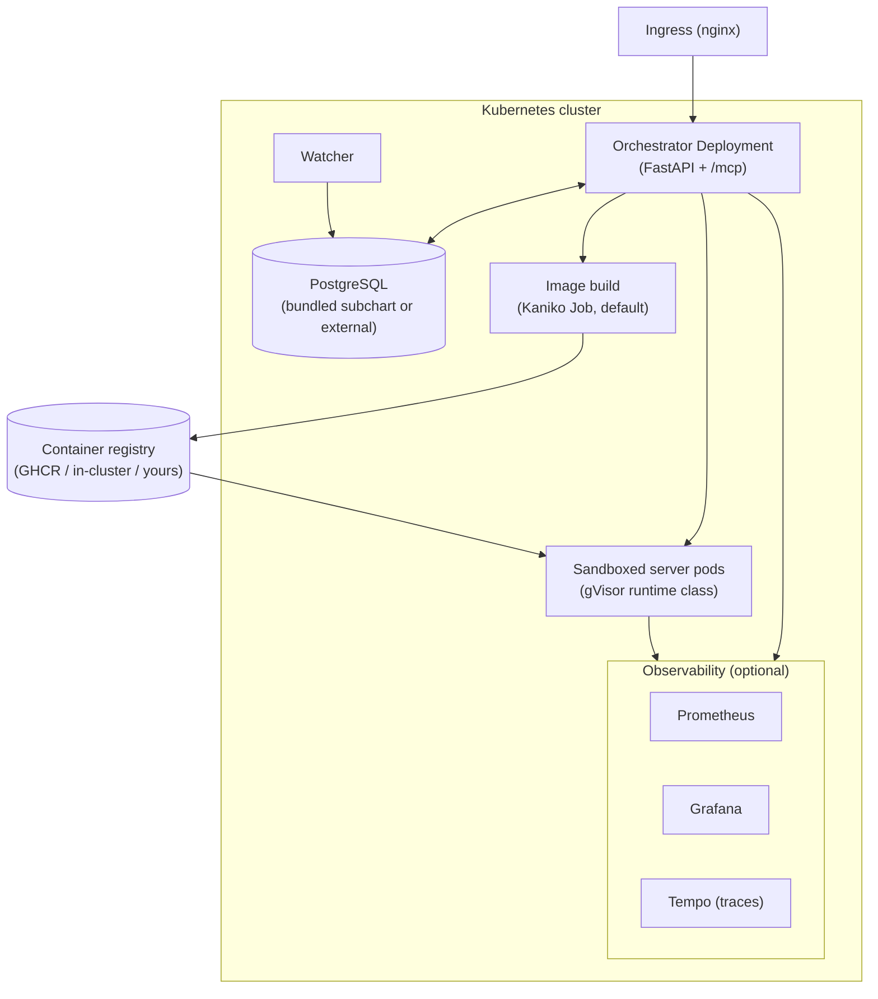

# Deployment

IdeGYM runs on Kubernetes. A single bundled **Helm chart** (`charts/idegym`) deploys the
orchestrator, a PostgreSQL database, and — optionally — the observability stack. This page
is the map; the [reference deployment guides](#full-guides) have the step-by-step.

## Topology



## What the chart deploys

- **Orchestrator** — the FastAPI control plane (`ClusterIP` Service; Ingress optional).
- **PostgreSQL** — bundled Bitnami subchart by default, or point at an external database
  via `database.*` overrides (and `postgresql.enabled=false`).
- **Watcher** — the background reconcile loop.
- **Observability (optional)** — Prometheus, Grafana, and Tempo, enabled with
  `--set {prometheus,grafana,tempo}.enabled=true`.

```shell
helm dependency update charts/idegym
helm install idegym charts/idegym -n idegym
# health check
kubectl port-forward svc/idegym 8000:80 -n idegym
curl http://localhost:8000/health   # → {"status":"healthy"}
```

## Upgrades and rollback

The orchestrator owns the database schema: it runs Alembic migrations on startup, forward
only. Each release therefore declares the exact revision its images expect
(`database.schemaRevision`), and refuses to start if that disagrees with the migrations it
actually contains.

Because Helm only restores Kubernetes resources, a bare `helm rollback` leaves the schema on
the newer revision — which the older image may not even know about. Roll back with
[`scripts/rollback.py`](https://github.com/JetBrains-Research/idegym/blob/main/scripts/rollback.py)
instead: it compares what the two releases declare and, when the target expects an older
revision, stops both database writers and downgrades the schema with the *currently deployed*
image before handing over to Helm. See [Database Rollback](/reference/database_rollback).

## Sandboxing with gVisor

Environment pods run untrusted code, so they're meant to run under the
[gVisor](https://gvisor.dev/) runtime class (`runtimeClassName: gvisor`) — a
user-space kernel that filters syscalls. You pass `runtime_class_name="gvisor"` when
defining an image or starting a server. The cluster must have the gVisor runtime class
installed on its worker nodes.

## Registry

Built images need somewhere to live. Three common setups:

- **GHCR** — public IdeGYM base/orchestrator images; private project images via a
  `regcred` pull secret the orchestrator mounts into pods.
- **In-cluster registry** — the Minikube `registry` addon
  (`registry.kube-system.svc.cluster.local`), used by the e2e suite and local builds.
- **Your registry** — set `DOCKER_REGISTRY` (and `KANIKO_INSECURE_REGISTRY=true` for HTTP)
  on the orchestrator; mount Kaniko push credentials as a secret.
- **Artifact Registry** — for the GKE Cloud Build backend, point `DOCKER_REGISTRY` at an
  Artifact Registry repo (`<region>-docker.pkg.dev/<project>/<repo>`).

## Image build backends

Image builds go through a **pluggable backend**, selected with `IDEGYM_BUILD_BACKEND` and
**defaulting to `kaniko`** so existing clusters are unchanged:

- **`kaniko`** (default) — an in-cluster Job builds from the generated Dockerfile and pushes
  to the registry. No Docker daemon on the nodes; works on any Kubernetes cluster.
- **`cloudbuild_gke`** — offloads the build to [GCP Cloud Build](https://cloud.google.com/build)
  and pushes to Artifact Registry, authenticating with the orchestrator pod's Workload
  Identity service account. Requires `IDEGYM_CLOUDBUILD_PROJECT_ID`, `IDEGYM_CLOUDBUILD_REGION`,
  and `IDEGYM_CLOUDBUILD_STAGING_BUCKET`.

See the [image-builder reference — build backends](/reference/image_builder#build-backends)
for the full configuration and required GCP IAM roles.

## Observability

When enabled, the orchestrator and every pod export metrics and OpenTelemetry traces.
Grafana is pre-provisioned with Prometheus (metrics) and Tempo (traces) data sources.
Point tracing at your collector with `deployment.otel.tracing.endpoint`.

## Pod snapshots (GKE only)

On GKE, IdeGYM can **checkpoint a warmed-up server pod and restore future pods from it**,
skipping cold-start work like project indexing. The chart renders `PodSnapshotPolicy` and
`PodSnapshotStorageConfig` (gated on the `podsnapshot.gke.io/v1` API), grouping snapshots
by the `idegym.jetbrains.com/snapshot-id` label and pointing at a GCS bucket. Enable with
`podSnapshot.enabled=true`. See the
[orchestrator README — Pod Snapshots](https://github.com/JetBrains-Research/idegym/blob/main/orchestrator/README.md#pod-snapshots-checkpointrestore).

## MCP at scale

The orchestrator runs FastMCP in **stateless** mode by default
(`deployment.mcp.statelessHttp: true`), so you can scale replicas and uvicorn workers
freely. Switch to session mode only for SSE resumability — then pin ingress affinity on
the `Mcp-Session-Id` header and run one worker per pod.

## Full guides

| Guide | For |
|---|---|
| [Getting Started](/reference/getting_started) | Local dev setup + running tests |
| [Local Deployment](/reference/local_deployment) | Full stack on Minikube — macOS or Linux (GHCR or local builds) |
| [Remote Deployment](/reference/remote_deployment) | Production Kubernetes, secrets, node pools, snapshots |
| [Database Rollback](/reference/database_rollback) | Rolling a release back, schema included; writing reversible migrations |
