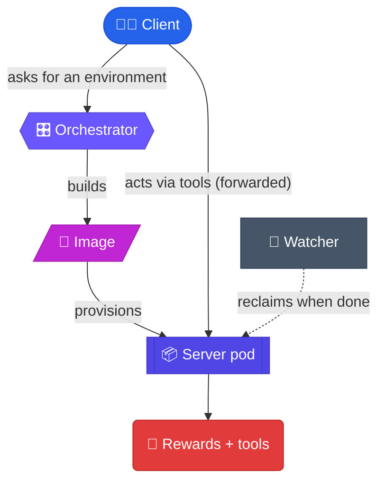

# Core concepts

IdeGYM creates **disposable, sandboxed development environments on demand** and hands
them to a program — an RL trainer, an AI agent, or any workflow that wants a clean,
reproducible workspace. Think *GitHub Codespaces, but optimized for thousands of
short-lived environments running in parallel*.

This page defines the handful of words you'll see everywhere. No Kubernetes knowledge
required.

## The one-sentence version

> You **describe** an environment, IdeGYM **builds** it into an image, **provisions** a
> sandboxed pod from it, lets you **act** inside it with tools and **score** the result
> with rewards, then **cleans up** automatically.

## The vocabulary

### Client
The thing that *wants* environments. In practice it's your Python program (a training
loop, an evaluation harness, an agent) using the **client library**, or an AI agent
talking over **MCP**. A client registers with the orchestrator, asks for servers, and is
assigned a resource quota.

### Orchestrator
The **control plane** — a single FastAPI service that everything goes through. It tracks
state in PostgreSQL, builds images, creates and tears down environment pods on
Kubernetes, and **forwards** your requests into the running environments. You never talk
to a pod directly; you talk to the orchestrator.

### Server (a.k.a. server pod / environment)
A **single disposable environment**: one Kubernetes pod, ideally sandboxed with
[gVisor](https://gvisor.dev/), running a small FastAPI **server** inside. That in-pod
server is what actually executes your bash commands, edits files, runs tests, and (when
an IDE is installed) exposes IDE inspection. "Start a server" = "give me a fresh
environment."

### Image
The **blueprint** for an environment — a container image. Instead of writing a
Dockerfile by hand, you compose an image from **plugins** using a fluent Python API (or
YAML): a base system, a user, your project, optionally an IDE, and the IdeGYM server
runtime. The image is built once and reused to start many servers.

### Plugin
A **reusable building block** with up to three jobs: contribute to the **image** (what
goes in the container), add **server** endpoints (what the environment can do), and add
typed **client** methods (how you call them). The PyCharm and IntelliJ IDEA integrations
are plugins; so are the built-in `base-system`, `user`, `project`, `tools`, and `rewards`.
See the [plugin system](/architecture/plugins).

### Tool
An **action** an agent can take inside an environment: run a bash script, create / edit /
patch a file, or — with an IDE plugin — run a full static-analysis inspection. Tools are
exposed both as HTTP endpoints and as **MCP tools**.

### Reward
A **score** for evaluation. After an agent acts, you can ask the environment to run a
compilation check, a setup check, or a test suite and return a pass/fail or pass-count
signal — the reward an RL loop trains against.

### MCP (Model Context Protocol)
The **agent-native interface**. The orchestrator exposes every operation at `/mcp` as an
[MCP](https://modelcontextprotocol.io) tool, and every environment exposes its own `/mcp`
gateway. Agents discover and call tools without touching the REST API. See
[MCP in the reference docs](/reference/mcp).

### Watcher
The **janitor**. A background loop that continuously compares the database against the
live cluster and reclaims anything stale — finished clients, crashed pods, orphaned
resources — so capacity never silently leaks. See the [watcher](/architecture/watcher).

### Kaniko
The **in-cluster image builder**. Building images inside Kubernetes (rather than needing
a Docker daemon on every node) is done with [Kaniko](https://github.com/GoogleContainerTools/kaniko)
jobs that build from the generated Dockerfile and push to a registry.

## How they fit together

## Next

- See the full lifecycle, end to end → [Data & usage flow](/overview/data-flow)
- Explore the system interactively → [Architecture](/architecture)
