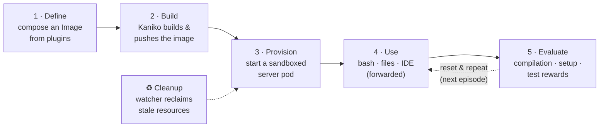
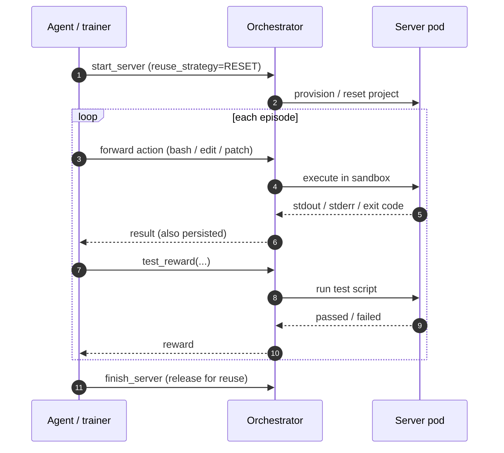

# Data & usage flow

This is the lifecycle a researcher or training loop actually drives, start to finish.
Five stages: **define → build → provision → use → evaluate**, with **cleanup** running
continuously in the background.



## 1 · Define the environment

You describe what the environment needs — a base image, a user, your project, optionally
an IDE — by composing **plugins** with the fluent `Image` API. No Dockerfile by hand.

```python
from idegym.image.builder import Image
from idegym.plugins.defaults.image import User, Project, Permissions

image = (
    Image.from_base("ghcr.io/jetbrains-research/idegym/server-debian-bookworm-20250520-slim:latest")
    .with_plugin(User(username="devuser", uid=2000, gid=2000, sudo=True))
    .with_plugin(Project.from_git(
        url="https://github.com/owner/my-repo.git",
        ref="abc123",
        owner="devuser",
        target="/home/devuser/project",
    ))
    .with_runtime(runtime_class_name="gvisor", resources={...})
)
```

Each plugin updates a shared [`BuildContext`](/architecture/image-builder) and emits a
Dockerfile fragment. Calling `image.to_spec()` compiles the whole thing into an
`ImageBuildSpec` (the final Dockerfile + metadata).

## 2 · Build the image

The image definition is serialized to YAML and submitted to the orchestrator, which runs
a **Kaniko** build job inside the cluster and pushes the result to a registry — no Docker
daemon required on the nodes.

```python
summary = await client.jobs.build_and_push_images(path=yaml_path, namespace="idegym", timeout=600)
image_tag = summary.jobs_results[0].tag
```

The orchestrator passes download credentials (for private project repos) as Kaniko
`--build-arg` values and polls the job to completion. → [Image builder](/architecture/image-builder)

## 3 · Provision a sandboxed environment

Starting a server creates a Kubernetes Deployment from the built image. The pod pulls the
image and boots **Supervisor → FastAPI server** (and any in-pod IDE process). With the
`gvisor` runtime class, the container runs in a syscall-filtering sandbox.

```python
async with client.with_server(image_tag=image_tag, server_name="my-server",
                              runtime_class_name="gvisor") as server:
    ...
```

If a matching finished server already exists, IdeGYM can **reuse** it (optionally
restarting or resetting project state) instead of cold-starting — and can restore from a
**pod snapshot** to skip warm-up like project indexing. → [Orchestrator](/architecture/orchestrator)

## 4 · Use the environment

You never connect to the pod directly. Requests go to the orchestrator, which
**forwards** them (HTTP or MCP, including WebSockets for OpenEnv) into the server pod.
Inside, the **tools** plugin executes them.

```python
result = await server.execute_bash("python -m pytest -q")
await server.create_file("/home/devuser/project/new.py", "print('hi')\n")
await server.patch_file("/home/devuser/project/main.py", patch="--- ...")
```

Every forwarded request and response is **persisted** in PostgreSQL, so you can replay or
compute rewards offline later. → [What runs in the pod](/architecture/server) ·
[Tools](/architecture/rewards-tools)

## 5 · Evaluate with rewards

To turn an agent's actions into a training signal, ask the environment to score itself:

```python
result = await server.test_reward(test_script="cd /project && python -m pytest -q")
score = result.passed / (result.passed + result.failed)
```

Three built-in reward kinds — **compilation**, **setup**, and **test** — run a script in
the sandbox and return a structured result. → [Rewards & tools](/architecture/rewards-tools)

### The RL / eval inner loop



## ♻ Cleanup (always on)

A background **watcher** loop reconciles the database against the live cluster every
interval: it evicts servers whose clients are gone, detects crashed pods (over their
restart budget), and frees quota — no manual teardown. Stopping a client tears down all
its alive servers. → [Watcher](/architecture/watcher)

## See it as one diagram

Ready for the whole topology, with every node clickable?

→ **[Open the interactive architecture](/architecture)**
