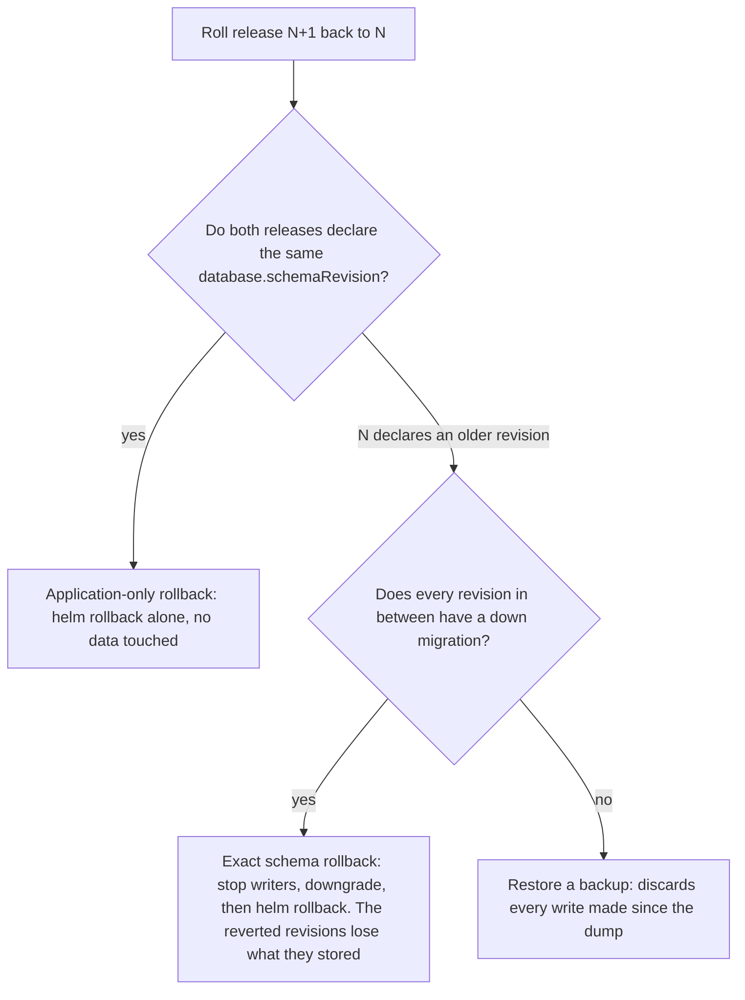
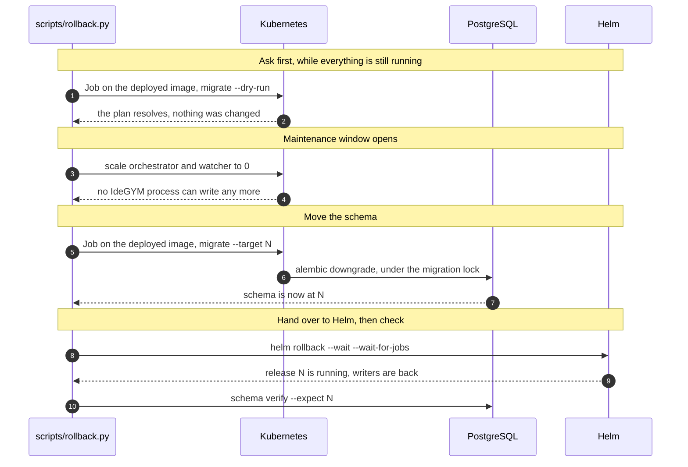

# Database Rollback

`helm rollback` restores Kubernetes resources and nothing else. The orchestrator migrates the
schema forward on startup, so after a failed upgrade the database is left on the *newer*
revision: the older image may not contain that revision at all, and Alembic cannot traverse a
revision whose script it does not have.

Rolling a release back therefore has to decide what to do about the schema. IdeGYM supports
three answers, and they are not interchangeable — they differ in what they cost you in data:



`scripts/rollback.py` makes the first decision for you, from what the two releases declare, and
refuses to continue if the second one comes out "no". The third row is a manual recovery path.

Everything here is an explicit operator action. Nothing restores a backup automatically — that
would silently turn a code rollback into a point-in-time data rollback.

---

## Every release declares its schema revision

`charts/idegym/values.yaml` carries the exact Alembic revision the release's images expect:

```yaml
database:
  schemaRevision: "003"
```

This is the value a rollback downgrades *to*, so three things keep it honest:

- the orchestrator refuses to start when it does not match its own migration head, so a
  mis-declared release fails its rollout instead of breaking a later rollback;
- a unit test compares it with Alembic's sole head, so CI fails on a migration that lands
  without bumping it;
- `scripts/rollback.py` reads it back from the *target* release with
  `helm get values --revision <n> --all`, so the target is whatever that release declared —
  never a relative guess like `-1`.

A release created before this mechanism existed declares nothing; rolling back to one requires
`--target-schema-revision` to state its revision explicitly.

---

## Rolling back

Always look at the history first, and ask for the plan before committing to it:

```shell
helm history idegym -n idegym

uv run python scripts/rollback.py \
  --release idegym --namespace idegym --revision 7 --dry-run
```

The dry run prints both schema revisions, the image that would run the downgrade, and — when a
downgrade is needed — the plan that image itself reports. That preflight runs as a short-lived
Job on the deployed image rather than `kubectl exec`, because a rollback usually follows a
failed rollout, when no pod of that image may be healthy enough to exec into. It reads the
schema and is deleted afterwards; the release, the schema, and both writers are untouched.

Then run it for real (drop `--dry-run`). A schema downgrade asks for confirmation unless you
pass `--yes`:

```shell
uv run python scripts/rollback.py \
  --release idegym --namespace idegym --revision 7
```

### Application-only rollback

When both releases declare the same revision, there is nothing to migrate: the command runs a
plain `helm rollback --wait`, then verifies the recorded revision and that both writers came
back. No maintenance window, no data loss.

This is also the right outcome when the newer schema is *compatible* with the older code —
[expand/contract migrations](#writing-reversible-migrations) are what make that true. Keeping a
compatible newer schema is preferable to downgrading it; the schema can be contracted later,
on the way forward.

### Exact schema rollback

When the target release declares an older revision, ordering is what keeps the rollback safe:



Three properties of that sequence matter:

- **The downgrade runs with the currently deployed image.** It is the only one that contains
  the migrations being reverted. The target release's image predates them and cannot run them.
- **Both writers are stopped first.** The advisory lock only serialises migrations against each
  other; it does not stop a running orchestrator or watcher from writing to a schema that is
  being changed underneath it.
- **Helm is never reached after a failed downgrade.** Rolling the resources back on top of a
  half-reverted schema would leave the old code facing a schema it cannot read.

### When a step fails

| Failure | State it leaves | What the command tells you |
|---|---|---|
| Preflight (unknown revision, no downgrade path, wrong image) | Untouched | Nothing was stopped |
| The downgrade Job | Writers stopped, schema possibly partly reverted, release unchanged | The Job's logs, and the `kubectl scale` commands that bring the current release back up |
| `helm rollback` after a successful downgrade | Writers stopped, schema at the target revision | Retry the Helm rollback, or migrate forward again and restart the current release |

A failed rollback never restarts a writer on its own: a database in an unknown state should be
looked at before anything writes to it again.

---

## Back up before you downgrade

A downgrade discards what the reverted revisions store — dropping a column drops its data, and
dropping a table drops all of it. Nothing in the rollback path can bring that back, so if the
data matters, take a logical dump first and keep it somewhere that outlives the pod:

```shell
kubectl exec -n idegym postgres-0 -- \
  env PGPASSWORD="$(kubectl get secret postgres -n idegym -o jsonpath='{.data.password}' | base64 -d)" \
  pg_dump -U idegym -Fc idegym > idegym-pre-rollback.dump
```

`pg_dump` is consistent while readers and writers keep running, but its recovery point is when
the dump *started*. For a zero-loss recovery point, stop the writers first (the rollback command
does that anyway) and dump before the downgrade Job runs.

### Restoring one

Restoring a dump discards every write made after it — including work created since the upgrade.
It is a recovery action, not a rollback, and it is always deliberate:

```shell
# 1. Stop every IdeGYM writer.
kubectl scale deployment idegym idegym-watcher -n idegym --replicas=0

# 2. Restore into the empty database. --clean --if-exists overwrites what is there.
kubectl exec -i -n idegym postgres-0 -- \
  env PGPASSWORD=... pg_restore -U idegym -d idegym \
      --clean --if-exists --no-owner --no-acl --single-transaction --exit-on-error \
  < idegym-pre-rollback.dump

# 3. Check the restored revision matches the release you are about to run.
kubectl exec -n idegym postgres-0 -- \
  env PGPASSWORD=... psql -U idegym -d idegym -tAc 'SELECT version_num FROM alembic_version;'

# 4. Bring the writers back at their original replica counts.
kubectl scale deployment idegym -n idegym --replicas=4
kubectl scale deployment idegym-watcher -n idegym --replicas=1
```

Release-bound automatic backups (a pre-upgrade Job, retention, checksum-verified restore) are
not implemented yet; until they are, the dump above is the recovery point and taking it is part
of the upgrade procedure.

---

## The migration CLI

`scripts/rollback.py` drives the schema through a CLI in the orchestrator image, which reads the
same database configuration the service does. It is also useful on its own for inspection:

```shell
# What the database is at, and what this image can reach.
kubectl exec deployment/idegym -n idegym -- \
  uv run python -m idegym.orchestrator.db_cli schema current
kubectl exec deployment/idegym -n idegym -- \
  uv run python -m idegym.orchestrator.db_cli schema head

# What a move would do, without doing it.
kubectl exec deployment/idegym -n idegym -- \
  uv run python -m idegym.orchestrator.db_cli migrate --target 002 --dry-run
```

`migrate` takes one exact revision (or `base`) — never a relative offset — and refuses a
backwards move unless `--allow-downgrade` is passed, so a mistyped target cannot drop columns.
It fails rather than guessing when the target is unknown, when the database sits on a revision
the image does not contain, when a revision being reverted ships no down migration, or when
another process holds the migration lock.

Run `migrate` by hand only with every writer stopped. With the orchestrator running, its next
starting replica migrates the schema straight back to its own head.

---

## Writing reversible migrations

An exact schema rollback is only as good as the down migrations it runs, and the least
disruptive rollback is the one that does not need them.

- **Prefer expand/contract.** Add tables and nullable columns first; ship code that tolerates
  both shapes; remove or rename in a later release. Release N's migration must be safe while
  N-1's orchestrator and watcher are still running — a rolling update overlaps them by design.
- **Ship `<rev>_up.sql` and `<rev>_down.sql` together.** The downgrade path is checked against
  those files before anything runs; a revision without a down migration cannot be reverted and
  turns an exact rollback into a backup restore.
- **Say what a downgrade discards**, in a comment next to the SQL. `003_down.sql` drops columns;
  `002_down.sql` drops whole tables. That difference is what an operator is approving.
- **Keep the history linear.** Exact-revision migration is only well defined without branches;
  a merge revision is rejected rather than traversed in an arbitrary order.

Every revision's up/down pair is exercised against real PostgreSQL, with data seeded at each
step, in
[`integration-tests/database/test_migration_roundtrip.py`](https://github.com/JetBrains-Research/idegym/blob/main/integration-tests/database/test_migration_roundtrip.py).

See also
[`orchestrator/src/idegym/orchestrator/migrations/README.md`](https://github.com/JetBrains-Research/idegym/blob/main/orchestrator/src/idegym/orchestrator/migrations/README.md)
for how to create a migration, and
[Remote Deployment](/reference/remote_deployment#updating-the-orchestrator) for the upgrade
procedure this reverses.
